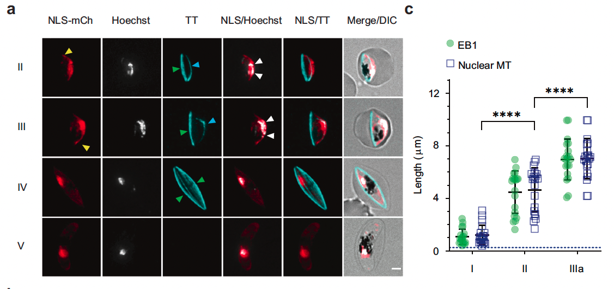
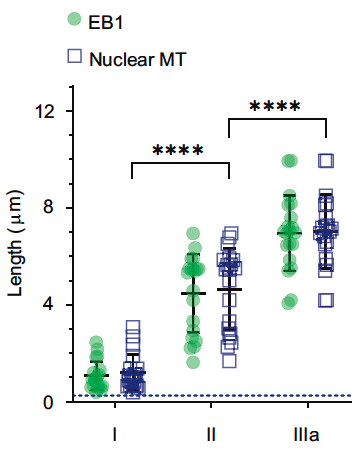

# Introduction

In this document is created as part of my presentation at BOMP research meeting 2023 September 19th. I will present two examples related to the main paper for discussion this month:

Senft RA, Diaz-Rohrer B, Colarusso P, Swift L, Jamali N, et al. (2023) A biologist's guide to planning and performing quantitative bioimaging experiments. *PLOS Biology* 21(6): e3002167. <https://doi.org/10.1371/journal.pbio.3002167>

# Example 1: Superplot

As them main paper suggested, a superplot provides not only summary statistics (e.g. mean) but also data distribution which includes individual data points.

The data and code from this exercise is from the paper below:

Samuel J. Lord, Katrina B. Velle, R. Dyche Mullins, Lillian K. Fritz-Laylin; SuperPlots: Communicating reproducibility and variability in cell biology. *J Cell Biol* 1 June 2020; 219 (6): e202001064. <https://doi.org/10.1083/jcb.202001064>

### Load libraries

```{r, message=FALSE}
library(dplyr)
library(ggplot2)
library(ggbeeswarm)
library(ggpubr)
library(pwr)
library(data.table)
library(ggforce)
library(car)
library(multcomp)
library(stringr) 
```

### Import data

```{r}
dat <- read.table(file = "../dat/superplot data.txt",  # path to the file
           header = T,    # Whether to display the header
           sep = ",")     # Separator
head(dat)
```

### Data wrangling

```{r, warning=FALSE}
ReplicateAverages <- dat %>% 
  group_by(Treatment, Replicate) %>% 
  summarise_each(list(mean))
head(ReplicateAverages)
```

### Plot data

```{r}
ggplot(dat, 
       aes(x = Treatment, y = Speed, color = factor(Replicate))) + 
  geom_beeswarm(cex = 3) + # spread the individual data points
  geom_beeswarm(data = ReplicateAverages, size = 8) + 
  stat_compare_means(data = ReplicateAverages, 
                     comparisons = list(c("Control", "Drug")), 
                     method = "t.test", # add p value on the figure
                     paired = TRUE) +
  theme_classic()
```

# Example 2: Power analysis

In the main paper, it also mentions about running power analysis to estimate the required sample number.

Here is an example derived from the webpage: [https://www.alexanderdemos.org/ANOVA4.html#Cohen's\_(d)](https://www.alexanderdemos.org/ANOVA4.html#Cohen’s_(d)){.uri}

To run a power analysis for sample size estimation, you will need:

1.  Effect size (in Cohen's d): based on literature
2.  significance level: 0.05
3.  power: 0.8

In the the function pwr.t.test, you put NULL for the parameter you aim to estimate.

```{r}
power.analysis <- pwr.t.test(n = NULL, 
                             d = 0.4, 
                             sig.level = 0.05,
                             power = 0.80, 
                             type = c("two.sample"), 
                             alternative = c("two.sided"))
power.analysis
```

# Example 3: Statistical analysis and data visualisation in R

Here is an example statistical analysis replicate the analysis run in GraphPad Prism 8 in the following paper:

Li, J., Shami, G.J., Cho, E. et al. Repurposing the mitotic machinery to drive cellular elongation and chromatin reorganisation in Plasmodium falciparum gametocytes. *Nat Commun* 13, 5054 (2022). <https://doi.org/10.1038/s41467-022-32579-4>

I am trying to replicate the stats figure here:



### Import data and dat wrangling

```{r}
length.dat.raw <- read.csv("../dat/figure2c data.csv", header = F)

temp.lengthdat1 <- length.dat.raw[3:5, 1:21] %>% 
  transpose()  %>% janitor::row_to_names(1) %>% 
  tidyr::gather(key = "stage", value = "length") %>% 
  mutate(treatment = "EB1")

temp.lengthdat2 <- length.dat.raw[8:10, 1:21] %>% 
  transpose()  %>% janitor::row_to_names(1) %>% 
  tidyr::gather(key = "stage", value = "length") %>% 
  mutate(treatment = "MT")

length.dat <- bind_rows(temp.lengthdat1, temp.lengthdat2) %>% 
  mutate(across('stage', str_replace, 'III', 'IIIa'))


#assign data class
length.dat$length <- as.numeric(length.dat$length)
length.dat$stage = as.factor(length.dat$stage)
length.dat$treatment = as.factor(length.dat$treatment)
```

### Plot the data

```{r}
ggplot(length.dat,
       aes(x = stage, y = length, category = treatment, fill = treatment)) +
  geom_violin(alpha = 0.8) +
  geom_sina(alpha = 0.5) +
  scale_fill_brewer(palette = "Dark2", name = "Treatment") +
  geom_boxplot(width = .1, 
               alpha = 0.5, 
               position = position_dodge(.9))+
  stat_summary(fun = "mean", geom = "point",
               position = position_dodge(.9))  +
  stat_summary(fun.data = "mean_se", geom = "errorbar", width = .1,
               position = position_dodge(.9)) +
  ylab("Length (um)") +
  theme_classic()
```


### Two-way ANOVA

#### Data overview

```{r}
table(length.dat$stage, length.dat$treatment)
```

#### Normality test

```{r}
# Check normality using QQ plot
mod <- aov(length ~ stage * treatment,
  data = length.dat)
qqPlot(mod$residuals, id = F)
shapiro.test(mod$residuals)
```

```{r}
summary(mod)
```

Tukey post-hoc

```{r, warning=FALSE}
res_tukey <- glht(mod, linfct = mcp(stage = "Tukey"))
summary(res_tukey)
```
